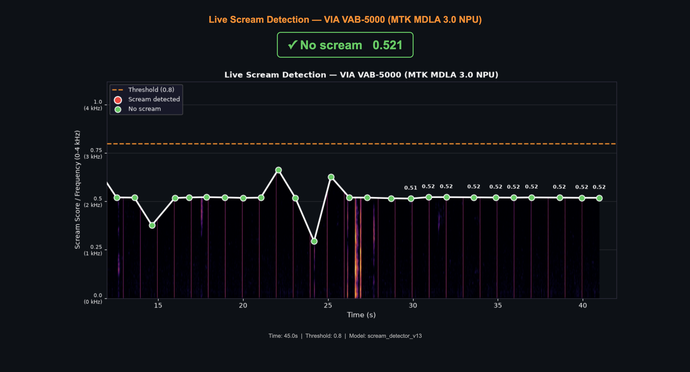

# 🚨 Scream Detector — VIA VAB-5000 (MTK MDLA 3.0 NPU)

> **This project is a summer internship project developed under the [VIA Technologies](https://www.viatech.com) internship program, VISVIA Software Team. All rights reserved © VIA Technologies, Inc.**

A real-time scream and distress detection system for public safety monitoring in transit environments (subways, buses). Runs on the **VIA VAB-5000** edge AI board powered by the **MediaTek Genio 700 SoC**, with inference accelerated by the **MDLA 3.0 NPU**.



---

## 📋 Overview

This project detects screams and cries for help in public spaces using a two-stage AI pipeline:

```
Microphone (USB) → CPU: YAMNet embedding → NPU (MDLA 3.0): Custom classifier → Alert
```

| Component | Details |
|-----------|---------|
| **Board** | VIA VAB-5000 (MediaTek Genio 700) |
| **NPU** | MDLA 3.0 (compiled via MediaTek NeuroPilot `ncc-tflite`) |
| **Feature extractor** | YAMNet (frozen, CPU) → 1024D embedding |
| **Classifier** | Custom Dense network (NPU-accelerated via DLA) |
| **Teacher model** | CLAP (laion/clap-htsat-fused, 154M params) for knowledge distillation |
| **Training data** | 96,418 samples (Kaggle + AudioSet + augmented) |
| **Detection threshold** | 0.8 (configurable) |

---

## 🏗️ Architecture

### Model Pipeline

```
Raw Audio (48kHz stereo)
        ↓
  Resample → 16kHz mono
        ↓
  YAMNet backbone (frozen, CPU)
  → 1024-dimensional embedding
        ↓
  Custom classifier (NPU - MDLA 3.0 DLA):
    Dense(512) → Dropout(0.4)
    Dense(256) → Dropout(0.3)
    Dense(64)  → Dropout(0.2)
    Dense(1)   → Sigmoid
        ↓
  Scream probability (0–1)
```

### Knowledge Distillation

The classifier was trained using knowledge distillation from **CLAP** (Contrastive Language-Audio Pretraining, 154M parameters):

- **Teacher**: `laion/clap-htsat-fused` — generates soft probability labels using the prompt *"woman or man screaming loudly in fear"*
- **Student**: Our small custom classifier (deployed on NPU)
- **Loss**: Combined hard label loss (BCE) + soft label loss (KL divergence)
- **Soft label separation**: 0.93 (scream) vs 0.33 (non-scream)

---

## 📊 Model Performance

| Metric | Value |
|--------|-------|
| Precision | 0.603 |
| Recall | 0.781 |
| F1-Score | 0.681 |
| ROC-AUC | 0.892 |
| Test samples | 14,463 |

### Threshold Analysis

| Threshold | Precision | Recall | F1 |
|-----------|-----------|--------|-----|
| 0.3 | 0.523 | 0.867 | 0.653 |
| 0.5 | 0.603 | 0.781 | 0.681 |
| 0.7 | 0.712 | 0.643 | 0.676 |
| **0.8** | **0.740** | **0.610** | **0.669** |

### Real-World Test Results

| Audio | Score | Detected |
|-------|-------|----------|
| Pure scream (no background) | 0.97 | ✅ |
| Scream over café music | 0.99 | ✅ |
| Scream over singing/music | 0.98 | ✅ |

---

## 📦 Dataset

Training data was assembled from three sources:

| Source | Samples | Label |
|--------|---------|-------|
| Kaggle Human Screaming Detection Dataset | 862 scream / 2,631 non-scream | Hard |
| Google AudioSet scream clips (374 files) | ~5,177 windows | Soft (CLAP) |
| Google AudioSet background/vocal clips (1,600 files) | ~19,639 windows | Soft (CLAP) |
| Augmented noisy screams (Kaggle × background mix) | ~2,586 | Soft (CLAP) |
| **Total** | **96,418** | |

Augmentation: original scream clips mixed with background noise at SNR levels of 0.3, 0.5, and 0.7 to simulate real-world noisy environments.

---

## 🛠️ Hardware Requirements

- **VIA VAB-5000** (MediaTek Genio 700 SoC)
- **OS**: Debian 12 EVK image
- **USB Microphone** (tested with Alcor Micro USB Audio Device, 48kHz stereo)
- **Network**: WiFi or Ethernet (for web dashboard)

---

## 🚀 Installation

### 1. Clone the repository

```bash
git clone https://github.com/YOUR_USERNAME/scream-detector-vab5000.git
cd scream-detector-vab5000
```

### 2. Install dependencies

```bash
pip3 install tensorflow flask scipy matplotlib --break-system-packages
sudo apt install python3-tk -y
```

### 3. Download model files

Download the following files and place them in `/home/jordanlee/`:

| File | Description |
|------|-------------|
| `yamnet_embedding.tflite` | YAMNet embedding extractor |
| `scream_detector_v13.tflite` | Custom scream classifier (TFLite) |
| `scream_detector_v13.dla` | NPU-compiled classifier (MDLA 3.0) |

Compile the DLA file if needed:
```bash
sudo ncc-tflite --arch mdla3.0 --relax-fp32 \
  -d scream_detector_v13.dla scream_detector_v13.tflite
```

### 4. Set up the run command

```bash
chmod +x scripts/scream_live
sudo ln -sf $(pwd)/scripts/scream_live /usr/local/bin/scream_live
```

---

## 🎮 Usage

### Live Web Dashboard

```bash
scream_live
```

Then open **http://jordan-vab.local:5000** in your browser. The dashboard shows:
- Real-time scream probability score
- Live graph with frequency content overlay
- Rolling 30-second window
- Color-coded detection status

### 5-Second Analysis Demo

```bash
python3 scripts/scream_analysis_demo.py
```

Records 5 seconds of audio (with 3-second countdown) and generates 5 analysis graphs saved to a timestamped folder.

### File-Based Testing

```bash
python3 scripts/test_audio_file.py path/to/audio.wav
```

---

## 📁 Repository Structure

```
scream-detector-vab5000/
├── README.md
├── requirements.txt
├── scripts/
│   ├── scream_live              # Shell launcher
│   ├── live_scream_web.py       # Live web dashboard
│   ├── scream_analysis_demo.py  # 5-second analysis demo
│   └── test_audio_file.py       # Test on a WAV file
├── training/
│   ├── generate_clap_labels.py  # CLAP soft label generation
│   ├── train_v13.py             # Final model training script
│   └── download_audioset.py     # AudioSet data download
├── models/
│   └── .gitkeep                 # Model files go here (not committed)
└── assets/
    └── demo_screenshot.png
```

---

## 🧪 Training Your Own Model

### 1. Generate CLAP soft labels (requires GPU)

```bash
python3 training/generate_clap_labels.py
```

This runs CLAP (154M parameter teacher model) on all training audio to generate soft probability labels.

### 2. Train the classifier

```bash
python3 training/train_v13.py
```

Training takes ~5 minutes on an NVIDIA GPU.

### 3. Compile for NPU

```bash
sudo ncc-tflite --arch mdla3.0 --relax-fp32 \
  -d models/scream_detector_v13.dla models/scream_detector_v13.tflite
```

---

## 📈 Live Dashboard Preview

The web dashboard auto-refreshes every 2 seconds and shows:

- **Status badge**: Green (no scream) / Red (scream detected) with live score
- **Probability graph**: White line showing scream score over time
- **Frequency overlay**: Spectrogram colors fill the area below the score line (inferno colormap)
- **Colored dots**: Red = scream detected, Green = no scream
- **Threshold line**: Orange dashed line at configured threshold

---

## ⚙️ Configuration

Edit `live_scream_web.py` to change:

```python
THRESHOLD = 0.8        # Detection threshold (0-1)
WINDOW_SECONDS = 30    # Rolling window width
RECORD_SECONDS = 1     # Audio chunk duration
```

---

## 🔬 Technical Notes

### Why a split pipeline?

YAMNet's TFLite model uses `kTfLiteComplex64` operations for STFT preprocessing, which the MTK MDLA 3.0 NPU does not support. The solution is a split pipeline:

- **CPU**: Raw audio → STFT → mel spectrogram → 1024D embedding (YAMNet)
- **NPU**: 1024D embedding → scream probability (custom classifier compiled to DLA)

### NPU compilation

The custom classifier is compiled using MediaTek NeuroPilot:

```bash
sudo ncc-tflite --arch mdla3.0 --relax-fp32 \
  -d scream_detector_v13.dla scream_detector_v13.tflite
```

The `--relax-fp32` flag handles quantization boundary operations.

---

## 📄 License

MIT License — see [LICENSE](LICENSE) for details.

---

## 🙏 Acknowledgements

- [YAMNet](https://tfhub.dev/google/yamnet/1) — Google's audio event classifier
- [CLAP](https://huggingface.co/laion/clap-htsat-fused) — LAION's contrastive language-audio model
- [Human Screaming Detection Dataset](https://www.kaggle.com/datasets/whats2000/human-screaming-detection-dataset) — Kaggle
- [AudioSet](https://research.google.com/audioset/) — Google Research
- [VIA Technologies](https://www.viatech.com) — VAB-5000 hardware platform
- MediaTek NeuroPilot SDK — NPU compilation toolchain
